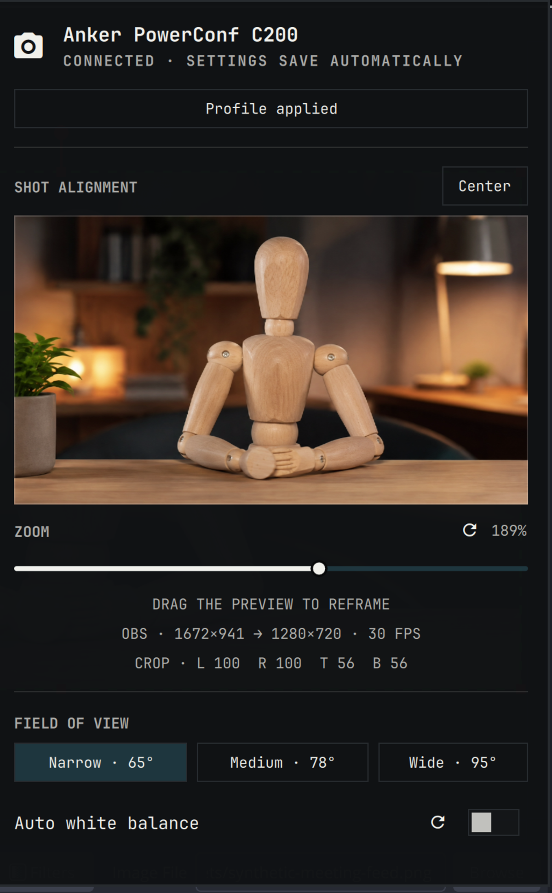
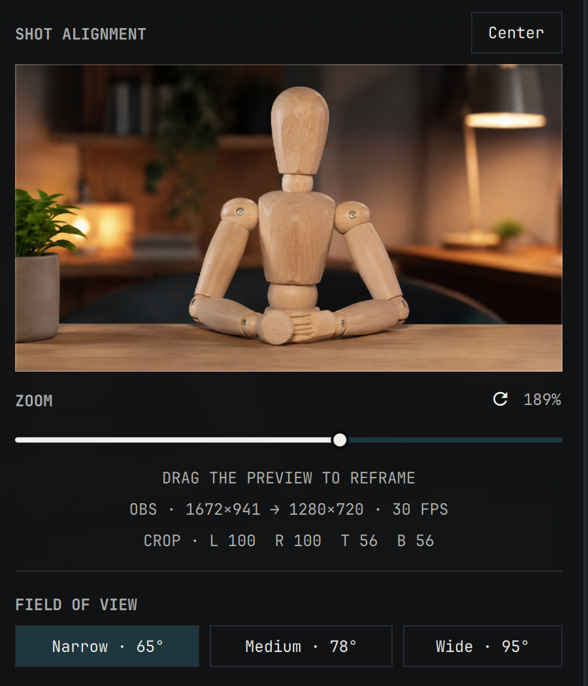

<div align="center">

# Anker C200 Controls

**Preview, tune, and frame an Anker PowerConf C200 from the Omarchy bar**

[Install](#install) · [Use](#use) · [OBS integration](#obs-integration-optional) · [Security](#security) · [Remove](#remove)

</div>

Anker C200 Controls is an Omarchy Quattro bar widget for the Anker PowerConf
C200 webcam. It keeps the camera controls close at hand and provides a live
preview whether or not OBS is running.



## Features

- Live 16:9 camera preview in the bar panel
- Direct physical-camera preview when OBS is not running
- Automatic switch to the OBS Virtual Camera preview while OBS is running
- Drag-to-reframe OBS output beneath a fixed crop, plus one-click centring
- Smooth, coalesced drag updates over one panel-scoped OBS connection
- Anker field-of-view presets: narrow (65°), medium (78°), and wide (95°)
- White balance, colour temperature, brightness, contrast, saturation,
  sharpness, autofocus, and hardware zoom controls
- Live automatic white-balance temperature, with the saved manual temperature
  restored when automatic white balance is turned off
- Live camera readback, verified writes, and a visible saved-profile drift state
- Automatic one-shot profile recovery when OBS takes ownership of the camera
- Camera-busy diagnostics that identify an unexpected local process using it
- OBS input/output resolution, frame rate, virtual-camera state, and exact crop
- Per-control resets where the C200's V4L2 driver reports a default
- Persistent meeting settings that are reapplied when the plugin or camera reconnects
- Automatic local setup of the bundled, pinned Anker controller on first use
- No third-party Python packages

## Requirements

- **Omarchy Quattro** with its standard Quickshell, Qt Multimedia, and Python 3
  runtime and C compiler
- An Anker PowerConf C200 webcam (`291a:3369`)
- Optional: OBS Studio with obs-websocket for virtual-camera preview and
  drag-to-reframe controls

## Install

Install and enable the plugin:

```bash
omarchy plugin add https://github.com/camerontucker/omarchy-anker-c200.git --enable
```

That is the complete required setup. On first use, the plugin compiles the
pinned, bundled
[`anker-powerconf-c200-linux-tools`](https://github.com/erans/anker-powerconf-c200-linux-tools)
source into a private cache under `$XDG_CACHE_HOME/anker-c200`. It performs no network
download, asks for no elevated privileges, and does not invoke a package
manager. Only the bundled, SHA-256-pinned source is supported: executables in
`PATH` or `~/.local/bin` are never used. The compiler is `/usr/bin/cc`, with a
clean environment. Cache artifacts are digest-checked and executed through an
immutable sealed memory descriptor, never by reopening a cache pathname.
If local compilation is unavailable, the panel reports the setup
error and continues in preview-only mode.

Settings and cache paths must have user-owned, non-symlink parents that are not
group/world writable. New plugin data uses private directories and mode-0600
files. OBS's credential file must be a user-owned mode-0600 regular file;
unsafe files are rejected without reading or changing their contents. Helper
requests have byte limits and hard deadlines, and their process trees are
terminated and reaped when the panel component is destroyed. A failed framing
helper reconnects automatically while the preview remains open.

For local development, install from a checkout instead:

```bash
omarchy plugin add ~/Work/omarchy-anker-c200 --enable
```

## Use

Click the camera icon in the right side of the Omarchy bar, or open the panel
from a terminal:

```bash
omarchy-shell anker.c200 open
```

Bar shortcuts:

- Left click opens or closes the panel.
- Middle click refreshes camera and OBS state.
- Right click reapplies the saved meeting profile.

The preview mode is selected automatically:

| State | Preview | Framing |
| --- | --- | --- |
| OBS is not running | Direct Anker camera | Hardware zoom and FOV controls |
| OBS is running | OBS Virtual Camera | Drag the preview or choose **Center** |

The preview captures frames only while the panel is open. Dragging never
changes the OBS output resolution: it moves the Anker scene item beneath its
existing fixed crop. A full-width or full-height preview gesture traverses the
complete crop range on that axis, and the scroll pane cannot interrupt an
active framing drag. The panel keeps one authenticated OBS connection while it
is open and coalesces pointer movement, avoiding process startup and scene
discovery work between frames.

Hardware zoom sits immediately below the preview. Drag a slider to change a
setting; the mouse wheel always scrolls the panel and never changes a hovered
control.



The panel separates the saved meeting profile from values read back from the
camera. **Profile applied** means every supported control matched. **Profile
drift** names controls that did not survive a reconnect or whose write was
ignored. Choose **Apply saved profile** to retry once; the plugin does not
continuously fight another camera application.

Reset icons appear only for controls whose defaults are reported by the V4L2
driver. Vendor-only controls such as field of view have no reliable driver
default and therefore are never reset speculatively.

Settings are stored in
`$XDG_CONFIG_HOME/anker-c200/settings.json` (normally
`~/.config/anker-c200/settings.json`). They are not deleted on removal.

## OBS integration (optional)

OBS Studio 28 and newer includes obs-websocket. In OBS:

1. Add the C200 to the current scene; include `Anker` or `PowerConf` in the
   source name.
2. Start the OBS Virtual Camera.
3. Open **Tools → WebSocket Server Settings**, enable the server, and keep
   authentication enabled.

The plugin connects only to `127.0.0.1`, reads the configured port and password
from OBS's local configuration, and uses the WebSocket only for reading and
updating the Anker scene item's crop. It never changes OBS settings by itself.

If OBS is not running, the panel offers **Start OBS**. Once OBS appears, the
plugin releases its direct preview, switches to the virtual camera, refreshes
the saved profile once, and displays the negotiated input/output format.

## Troubleshooting

- **Camera in use by …** — stop video in the named application or select OBS
  Virtual Camera there. The plugin ignores expected OBS and Quickshell handles.
- **Profile drift** — the camera returned a value different from the saved
  profile. Reapply the profile; if the same control remains named, the camera
  firmware or controller did not accept that value.
- **Virtual camera unavailable** — start it in OBS, then middle-click the bar
  icon to refresh.
- The C200 can reset controls when a capture client opens it. Readback is the
  source of truth; the panel never labels an unverified write as successful.

## Update

```bash
omarchy plugin update io.github.camerontucker.anker-c200
```

## Security

Omarchy plugins run as unsandboxed user code. This plugin reads local camera
device metadata, the exact names of running processes, its own settings, and—if
OBS framing is used—the local OBS WebSocket configuration. It has no telemetry,
cloud service, privilege escalation, or non-loopback network access. See
[SECURITY.md](SECURITY.md) for the complete interaction boundary.

## Remove

```bash
omarchy plugin remove io.github.camerontucker.anker-c200
```

Removal does not alter OBS or delete saved camera settings. The locally built
controller is disposable cache data under `$XDG_CACHE_HOME/anker-c200` and may
be removed separately.

## Acknowledgements

- [Omarchy](https://github.com/omacom/omarchy) by David Heinemeier Hansson and
  contributors provides the plugin platform and panel design language. The
  wheel-safe slider in this plugin is adapted from Omarchy's `PanelSlider`.
- [anker-powerconf-c200-linux-tools](https://github.com/erans/anker-powerconf-c200-linux-tools)
  by Eran Sandler provides the controller and the reverse-engineered Anker C200
  control foundation. Its pinned MIT-licensed source is bundled and built
  locally on first use.
- [Quickshell](https://github.com/quickshell-mirror/quickshell) provides the QML
  shell runtime used by the panel.
- [OBS Studio](https://github.com/obsproject/obs-studio) and its built-in
  obs-websocket API provide the optional virtual-camera and framing path.

See [THIRD_PARTY_NOTICES.md](THIRD_PARTY_NOTICES.md) for roles, licenses, and
upstream notices. These projects are not affiliated with or responsible for
this plugin.

## Development

```bash
./tests/run
```

[Changelog](CHANGELOG.md) · [MIT License](LICENSE)
